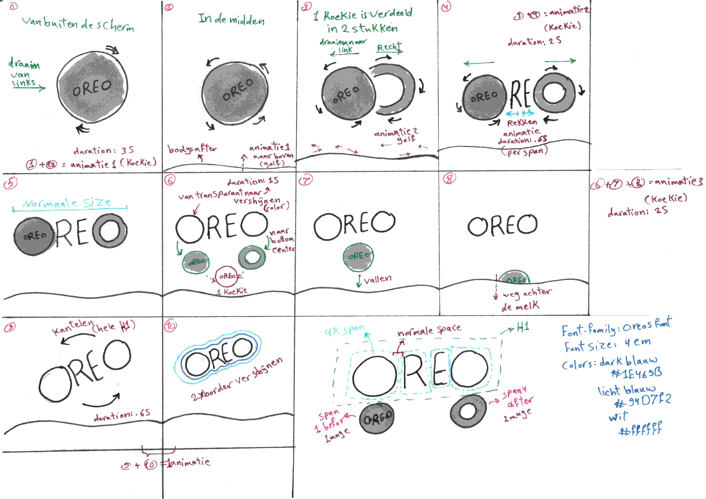
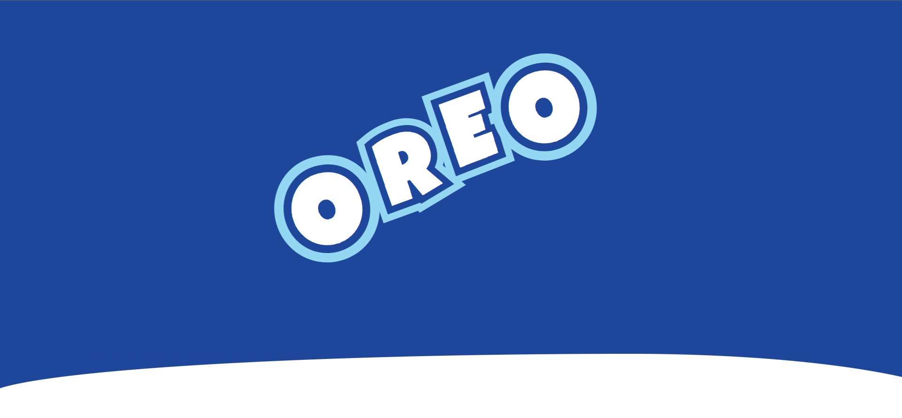
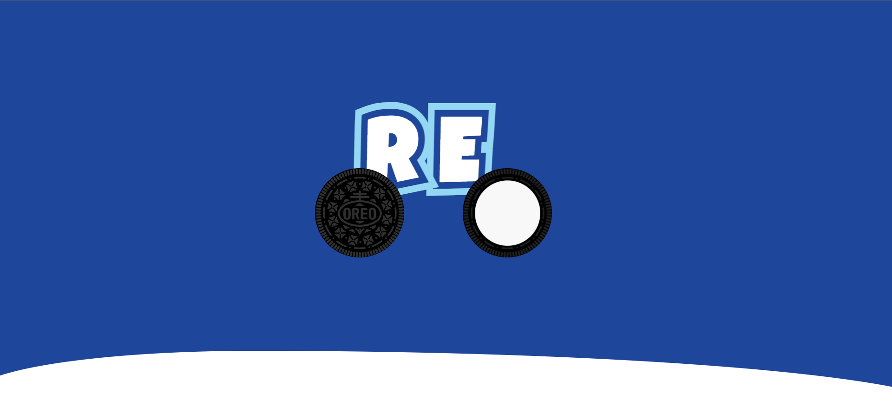
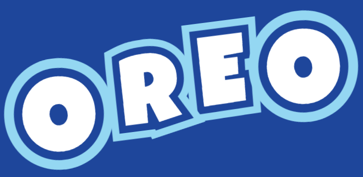
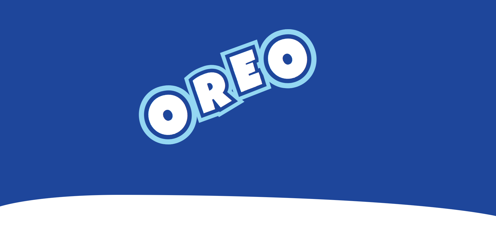
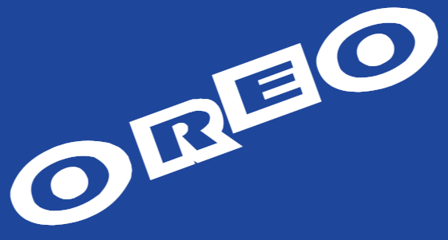

# Procesverslag
**Auteur:** Sundous Kanaan

**De opdrachten:** [opdracht 1](opdracht1/index.html) en [opdracht 2](opdracht2/index.html)

Markdown is een simpele manier om HTML te schrijven.  
Markdown cheat cheet: [Hulp bij het schrijven van Markdown](https://github.com/adam-p/markdown-here/wiki/Markdown-Cheatsheet).

Nb. De standaardstructuur en de spartaanse opmaak van de README.md zijn helemaal prima. Het gaat om de inhoud van je procesverslag. Besteedt de tijd voor pracht en praal aan je website.

Nb. Door *open* toe te voegen aan een *details* element kun je deze standaard open zetten. Fijn om dat steeds voor de relevante stuk(ken) te doen.

## Bronnenlijst
  1. Oreo cookie image van (https://nl.m.wikipedia.org/wiki/Bestand:Vector_Oreo.svg) dan heb ik het verandert met photoshop
  2. Oreos font van (https://fontmeme.com/fonts/oreos-font/)

## Opdracht 1 plan

  
uitwerken na schetsen idee (voor week 2)

  ### Je storyboard:
  

  ### Je ambitie: 
  Aan deze technieken/punten wil ik werken:
  - Maak een ingewikkeld animatie
  - Golf animatie
  - Border voor de hele woord
 

## Opdracht 1 reflectie

  
uitwerken bij afronden opdracht (voor week 4)

  ### Je uitkomst - karakteristiek screenshot(s):
  

  ### Dit ging goed/Heb ik geleerd: 
  Ik heb geleerd, hoe ik ingewikkelde animaties in verschillende tijden kan aanpassen om mijn idee te maken.

  

  Ik heb ook geleerd hoe kan ik twee borders kan maken voor mijn tekst
  

  Ik heb ook geleerd hoe kan ik iets zoals een golf kan maken via ::after met animatie. Het eindresultaat was geen professionele golf, maar het diende zijn doel en ik zie het als melk in een kopjeز
  

  ### Dit was lastig/Is niet gelukt:
  Mijn merk font is oreos font en het gratis versie is lelijk met dikke border en transparant letters. Na verschillende experimenten, zoals het invullen van letters, het toevoegen van een tweede border, besloot ik een ander lettertype te kiezen dat zoveel mogelijk geschikt zou zijn voor het merk.

  

## Opdracht 2 plan

  
uitwerken na schetsen idee (voor week 5)

  ### Je ontwerp:

  - 
  - 

  ### Je ambitie: 
  Aan deze technieken/punten wil ik werken:
  - Interactieve site maken
  - Mooie animaties en interacties maken.
  - Audiospeler customizen volgens mijn design
  
  ### Gebruikte API:
  Anime themes API: https://github.com/LetrixZ/animethemes-api
  - Deze API inkludt:
    - Artist name
    - Artist foto
    - Anime name
    - Anime foto
    - Anime jaar
    - Anime sezoen
    - Theme name
    - Theme type (OP / ED)
    - Theme quality
    - Theme video URL
    - Theme audio URL
  
  

## Opdracht 2 test

  
uitwerken na testen (week 7)

  Neem minimaal 5 bevindingen op:

  ### Bevinding 1:
  Omschrijving van wat er nog niet orde was (tekst en afbeeding(en)).

  #### oplossing:
  Beschrijving hoe je het hebt hebt opgelost of als het niet gelukt is hoe je het zou oplossen (tekst en afbeeding(en)).

  ### Bevinding 2:
  Omschrijving van wat er nog niet orde was (tekst en afbeeding(en)).

  #### oplossing:
  Beschrijving hoe je het hebt hebt opgelost of als het niet gelukt is hoe je het zou oplossen (tekst en afbeeding(en)).

  ### Bevinding 3:
  ...

## Opdracht 2 reflectie

  
uitwerken bij afronden opdracht (voor week 8)

  ### Je uitkomst - karakteristiek screenshot(s):
  

  ### Dit ging goed/Heb ik geleerd: 
  Korte omschrijving met plaatje(s)

  

  ### Dit was lastig/Is niet gelukt:
  Korte omschrijving met plaatje(s)

  

