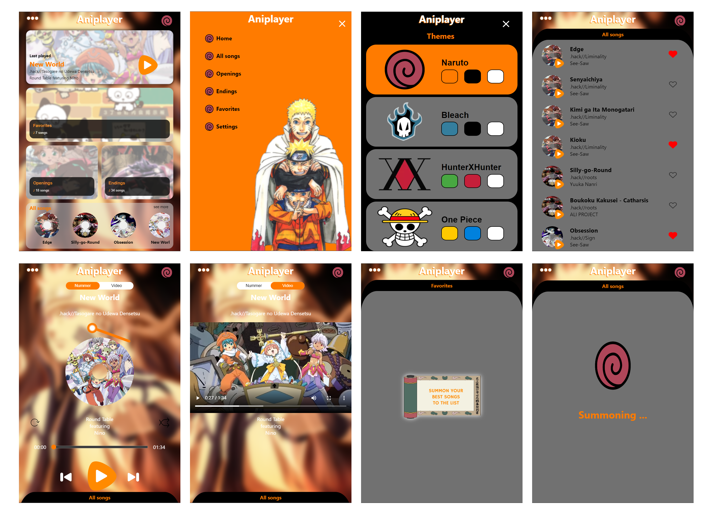
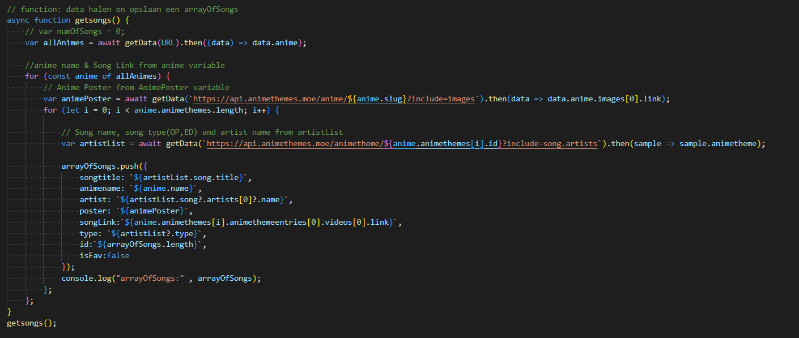
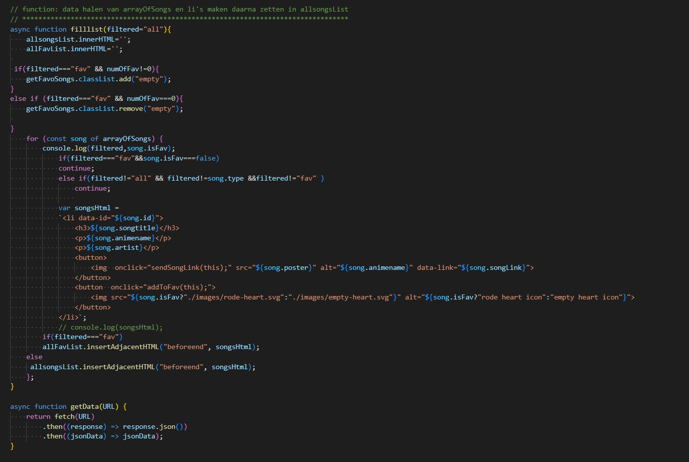

# Procesverslag
**Auteur:** Sundous Kanaan

**De opdrachten:** [opdracht 1](opdracht1/index.html) en [opdracht 2](opdracht2/index.html)

Markdown is een simpele manier om HTML te schrijven.  
Markdown cheat cheet: [Hulp bij het schrijven van Markdown](https://github.com/adam-p/markdown-here/wiki/Markdown-Cheatsheet).

Nb. De standaardstructuur en de spartaanse opmaak van de README.md zijn helemaal prima. Het gaat om de inhoud van je procesverslag. Besteedt de tijd voor pracht en praal aan je website.

Nb. Door *open* toe te voegen aan een *details* element kun je deze standaard open zetten. Fijn om dat steeds voor de relevante stuk(ken) te doen.

## Bronnenlijst
  1. Oreo cookie image van (https://nl.m.wikipedia.org/wiki/Bestand:Vector_Oreo.svg) dan heb ik het verandert met photoshop
  2. Oreos font van (https://fontmeme.com/fonts/oreos-font/)

## Opdracht 1 plan

  
uitwerken na schetsen idee (voor week 2)

  ### Je storyboard:
  

  ### Je ambitie: 
  Aan deze technieken/punten wil ik werken:
  - Maak een ingewikkeld animatie
  - Golf animatie
  - Border voor de hele woord
 

## Opdracht 1 reflectie

  
uitwerken bij afronden opdracht (voor week 4)

  ### Je uitkomst - karakteristiek screenshot(s):
  

  ### Dit ging goed/Heb ik geleerd: 
  Ik heb geleerd, hoe ik ingewikkelde animaties in verschillende tijden kan aanpassen om mijn idee te maken.

  

  Ik heb ook geleerd hoe kan ik twee borders kan maken voor mijn tekst
  

  Ik heb ook geleerd hoe kan ik iets zoals een golf kan maken via ::after met animatie. Het eindresultaat was geen professionele golf, maar het diende zijn doel en ik zie het als melk in een kopjeز
  

  ### Dit was lastig/Is niet gelukt:
  Mijn merk font is oreos font en het gratis versie is lelijk met dikke border en transparant letters. Na verschillende experimenten, zoals het invullen van letters, het toevoegen van een tweede border, besloot ik een ander lettertype te kiezen dat zoveel mogelijk geschikt zou zijn voor het merk.

  

## Opdracht 2 plan

  
uitwerken na schetsen idee (voor week 5)

  ### Je ontwerp:

  - 
  - 
  - concept-v2:
  

  ### Je ambitie: 
  Aan deze technieken/punten wil ik werken:
  - Interactieve site maken
  - Mooie animaties en interacties maken.
  - Audiospeler customizen volgens mijn design
  - Info halen van de Api en verwerken in mijn site
  
  ### Gebruikte API:
  Anime themes API (Niet geldig voor online werken): https://github.com/LetrixZ/animethemes-api

  Anime themes API: https://staging.animethemes.moe/api/docs/series/show/
  ِGebruikte endpoint van de API (handmade):: https://api.animethemes.moe/anime?include=animethemes.animethemeentries.videos
  
  - Deze API inkludt:
    - Anime info
    - Artist info
    - Anime foto
    - Themes info
    - Theme video URL
    - Anime Studio info

## Opdracht 2 test

  
uitwerken na testen (week 7)

  Neem minimaal 5 bevindingen op:

  ### Bevinding 1:
  Het was niet echt duidelijk dat de menutitel een knop is om het menu naar beneden te verplaatsen en de audiospeler weer te geven.
  - 

  #### oplossing:
  Verplaats de lijst naar beneden bij het selecteren van een nummer (transform)
  "transform: translatey(95%);"

  

  ### Bevinding 2:
  Sommige properties werkt niet op andere browsers zoals backdrop-filter op Firefox.
  - 

  #### oplossing:
  Ik zocht naar een oplossing maar kon het niet vinden

  ### Bevinding 3:
  De lijst met thema's heeft een margin nodig vanaf de onderkant in de telefoonmeting
  - 
  - 
  
    #### oplossing:
    De oplossing was eenvoudig, namelijk het aanpassen van de rijen
    - 
    - 
  
  ### Bevinding 4:
  Wanneer de light modus is ingeschakeld, veranderen de kleuren, maar de geselecteerde theme knop blijft verkeerd
  - 
  - 
  
    #### oplossing:
    Ik heb dit opgelost door te wijzigen waar de standaard knop kleur zich bevindt, deze toe te voegen aan de dark modus en de kleuren te wijzigen in de light modus
    - 
  

## Opdracht 2 reflectie

  
uitwerken bij afronden opdracht (voor week 8)

  ### Je uitkomst - karakteristiek screenshot(s):
   - 
   - 

  ### Dit ging goed/Heb ik geleerd: 
  Ik heb geleerd over de ِAPI, er informatie uit gehaald en op mijn site weergegeven. Mijn API was ingewikkeld maar na meerdere keren van proberen om zijn endpoint te begrijpen, het wordt beetje makkelijker.

  - 
  - 

  ### Dit was lastig/Is niet gelukt:
  Het was ingewikkeld om de informatie aan elkaar te koppelen en vervolgens in de speler weer te geven en de speler te laten werken zoals het hoort, dus ik vroeg een     vriend om hulp om dat te doen. Omdat hij Arabisch spreekt, was het iets gemakkelijker te begrijpen, het is nog steeds moeilijk voor mij, maar het kan gemakkelijker     worden als ik het herhaaldelijk gebruik.

